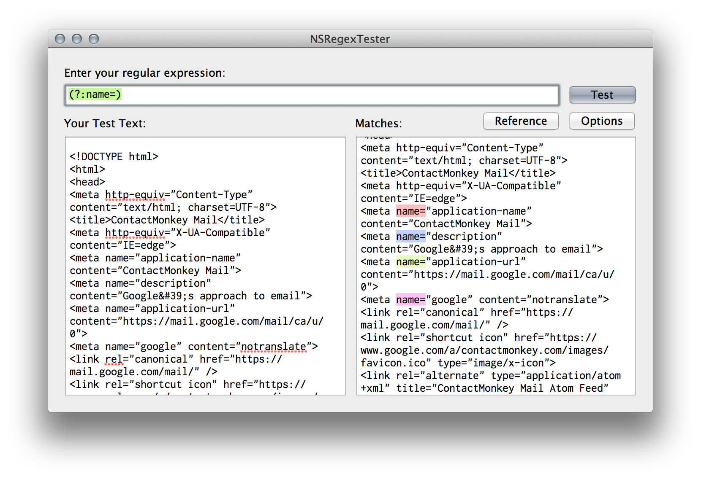

NSRegexTester
=============

This is a very simple Mac OS X application that allows you to test regular expressions against sample text. It is based on the Mac OS SDK's implementation of [NSRegularExpression](https://developer.apple.com/library/mac/#documentation/Foundation/Reference/NSRegularExpression_Class/Reference/Reference.html), which is based on [ICU](http://site.icu-project.org). 

My problem is that, as a Rails developer, I'd grown accustomed to using [Rubular](http://www.rubular.com), a brilliant regex testing tool. However, there are subtle differences in the syntax of regular expressions between the Mac SDK and others. This tool ensures that the expressions I enter will actually work when implemented in code.

##Download
If you just want a binary, [here you go](./NSRegexTester.zip).

##Screenshot

##License
This software is available as-is. You may use it without restriction, though I'd appreciate a credit.

##Usage
Feel free to adopt it, use it, love it and fork it. I'm happy to take any pull requests to improve it, though it's pretty well satisfying my requirements now.
